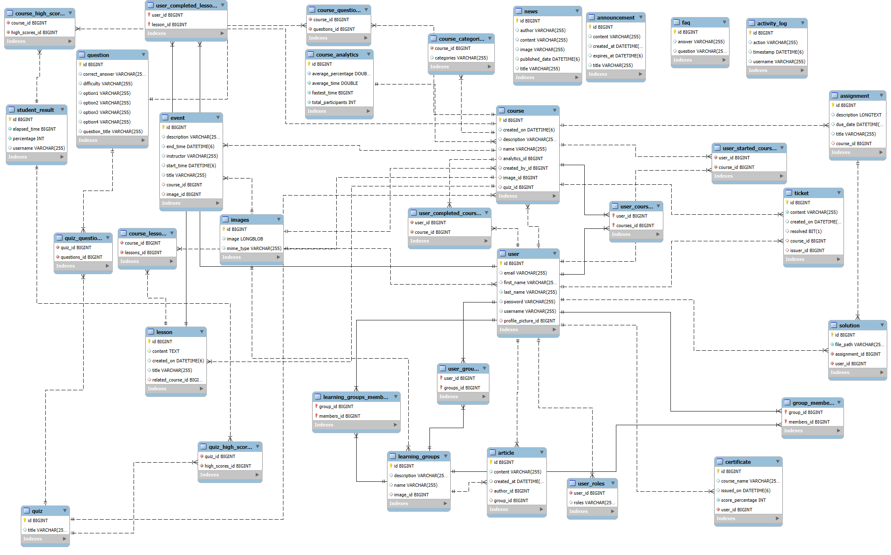

# E-Learning Platform

## System Features

### 1. User Roles
The system supports the following user roles:

1. **Unregistered User**:
   - Can view information pages and access sample content.
   - Cannot enroll in courses or access premium features.

2. **Student**:
   - Can enroll in courses, submit assignments, and take quizzes.
   - Can track learning progress through a personalized dashboard.
   - Can join groups, create articles, and view certificates.

3. **Instructor**:
   - Can create, edit, and manage courses and lessons.
   - Can view student performance analytics and provide feedback.
   - Can create quizzes and assignments.

4. **Administrator**:
   - Can manage user accounts, roles, and permissions.
   - Can oversee all courses and platform activity.
   - Can create news, events, and common questions.

---

### 2. Use Cases

#### 2.1 Browse Courses and Lessons
- **Actors**: All users.
- **Description**: Users can browse available courses and lessons on the platform.

#### 2.2 Register
- **Actors**: Unregistered User, Administrator.
- **Description**: Unregistered users can register by providing an email, name, and password. Administrators can register new users and assign roles.

#### 2.3 Login
- **Actors**: Student, Instructor, Administrator.
- **Description**: Registered users can log in using their email and password.

#### 2.4 Change User Data
- **Actors**: Registered User, Administrator.
- **Description**: Users can edit their personal data. Administrators can edit any user's data and assign roles.

#### 2.5 Manage Users
- **Actors**: Administrator.
- **Description**: Administrators can browse, filter, and manage users. They can edit or delete user accounts.

#### 2.6 Manage Student Groups
- **Actors**: Administrator, Instructor.
- **Description**: Users can create and manage student groups. Administrators can add or remove students from groups.

#### 2.7 Manage Courses
- **Actors**: Instructor, Administrator.
- **Description**: Instructors can create, edit, and delete courses. Administrators can oversee all courses.

#### 2.8 Add/Edit Course
- **Actors**: Instructor, Administrator.
- **Description**: Instructors and administrators can specify or edit course details, including lessons and resources.

#### 2.9 Add/Edit Lesson
- **Actors**: Instructor, Administrator.
- **Description**: Instructors and administrators can create or edit lessons within a course.

#### 2.10 Complete Lesson
- **Actors**: Student.
- **Description**: Students can mark lessons as completed to track their progress.

#### 2.11 Complete Course
- **Actors**: Student, Instructor.
- **Description**: Students complete all lessons and a final quiz to mark a course as complete.

#### 2.12 Monitor Course Progress
- **Actors**: Instructor, Administrator.
- **Description**: Instructors and administrators can monitor student progress through a dashboard.

#### 2.13 Browse Course Results
- **Actors**: Student, Instructor.
- **Description**: Students can view their course results. Instructors can view results for their courses.

#### 2.14 Manage Assignments
- **Actors**: Student, Instructor.
- **Description**: Students can complete assignments. Instructors can assign and grade assignments.

#### 2.15 Create Ticket
- **Actors**: Student.
- **Description**: Students can create support tickets for specific lessons or courses.

#### 2.16 Resolve Ticket
- **Actors**: Instructor.
- **Description**: Instructors can resolve support tickets by marking them as done.

#### 2.17 View Certificates
- **Actors**: Student.
- **Description**: Students can view certificates obtained after completing courses.

#### 2.18 Obtain Certificate
- **Actors**: Student.
- **Description**: Students receive certificates upon completing a course.

#### 2.19 Create Group
- **Actors**: Student, Instructor, Administrator.
- **Description**: Users can create groups by providing a name, description, and members.

#### 2.20 Manage Group
- **Actors**: Student, Instructor, Administrator.
- **Description**: Users can add members and articles to groups. Administrators can delete groups.

#### 2.21 Manage Articles
- **Actors**: Student, Instructor, Administrator.
- **Description**: Users can create articles within groups. Administrators can delete inappropriate articles.

#### 2.22 Create Quiz
- **Actors**: Instructor.
- **Description**: Instructors can create quizzes for courses.

#### 2.23 Change Quiz
- **Actors**: Instructor.
- **Description**: Instructors can update quizzes by adding or modifying questions.

#### 2.24 Complete Quiz
- **Actors**: Student.
- **Description**: Students can complete quizzes to pass courses.

#### 2.25 View Announcements
- **Actors**: All users.
- **Description**: Users can view platform-wide announcements.

#### 2.26 View Analytics
- **Actors**: Instructor.
- **Description**: Instructors can view course analytics, including student performance.

#### 2.27 View Activity Logs
- **Actors**: Administrator.
- **Description**: Administrators can view all activity logs on the platform.

#### 2.28 Create Category
- **Actors**: Instructor.
- **Description**: Instructors can create categories for courses.

#### 2.29 Create Common Question
- **Actors**: Administrator.
- **Description**: Administrators can add common questions and answers.

#### 2.30 View Common Questions
- **Actors**: Student, Instructor, Administrator.
- **Description**: Users can view common questions added by administrators.

#### 2.31 View Rankings
- **Actors**: Student, Instructor, Administrator.
- **Description**: Users can view their assigned ranks.

#### 2.32 Create Rank
- **Actors**: Administrator.
- **Description**: Administrators can create new ranks.

#### 2.33 Create News
- **Actors**: Administrator.
- **Description**: Administrators can create news articles.

#### 2.34 View News
- **Actors**: Student, Instructor, Administrator.
- **Description**: Users can view the latest news.

#### 2.35 Create Event
- **Actors**: Instructor.
- **Description**: Instructors can add new events.

#### 2.36 View Events
- **Actors**: Student, Instructor, Administrator.
- **Description**: Users can view upcoming events.

---

## 3. API Resources

The backend API provides the following resources:

| **Resource**            | **Description**                                                                | **URI**                                  |
|-------------------------|--------------------------------------------------------------------------------|------------------------------------------|
| Users                   | GET all users, POST new user data.                                             | `/api/users`                             |
| User                    | GET, PUT, DELETE user data by `userId`.                                        | `/api/users/{userId}`                    |
| User Roles              | GET a list of user roles.                                                      | `/api/user-roles`                        |
| Login                   | POST user credentials to receive a security token.                             | `/api/login`                             |
| Logout                  | POST to end the active session.                                                | `/api/logout`                            |
| Register                | POST to register a new user.                                                   | `/api/register`                          |
| Courses                 | GET all courses, POST new course.                                              | `/api/courses`                           |
| Course                  | GET, PUT, DELETE course by `courseId`.                                         | `/api/courses/{courseId}`                |
| Lessons                 | GET all lessons in a course, POST new lesson.                                  | `/api/lessons`                           |
| Assignments             | GET all assignments in a lesson.                                               | `/api/users/{userId}/assignments`        |
| Quizzes                 | GET all quizzes in a course, POST new quiz.                                    | `/api/course/{courseId}/quizzes`         |
| Certificates            | GET certificates issued for a course.                                          | `/api/users/{userId}/certificates`       |
| Tickets                 | POST new ticket, GET all tickets.                                              | `/api/users/{userId}/tickets`            |
| Groups                  | POST new group, GET all groups.                                                | `/api/groups`                            |
| Articles                | POST articles to a group, GET all articles.                                    | `/groups/{groupId}/articles`             |
| Announcements           | GET platform-wide announcements, POST new announcement.                        | `/api/announcements`                     |
| Course Analytics        | GET, PUT analytics for a course.                                               | `/api/course/{courseId}/analytics`       |
| Activity Log            | GET, POST activity logs.                                                       | `/api/activity-log`                      |
| Ranks                   | GET, POST ranks.                                                               | `/api/rankings`                          |
| Questions               | GET common questions, POST new question.                                       | `/api/help`                              |
| News                    | GET news, POST news.                                                           | `/api/news`                              |
| Events                  | GET all events, POST event.                                                    | `/api/events`                            |

## Database Schema

   

